# Introduction

### **Company Background**

Sittercity, founded in 2001, stands as a pioneer in the online caregiving service industry.The platform focuses on connecting families with a broad network of babysitters, nannies, pet sitters, senior care providers, and tutors.The user-friendly interface allows parents to search for caregivers based on various criteria, including location, experience, and specific skills.In the course of its two-decade existence, the company has evolved by incorporating advanced technologies like background checks and enhanced matching algorithms, ensuring safety and reliability.
Sittercity's impact is significant, modernizing the way families find and secure trusted care for their loved ones, establishing it as a notable entity in the caregiving industry.However, the company has faced controversies and customer complaints, particularly related to billing practices and customer service.[@SitterCityComplaints]

In 2020, amidst the COVID-19 pandemic, Sittercity observed a significant decline in parent subscriptions, while sitters' interest steadily rose.
Building on this discovery, the Smith College Sitter Team (SCST) further investigated the discrepancy in parental subscription declines through the internal Sittercity database and external customer reviews of the company.

Our research revealed an increase in parents working from home due to the pandemic and preferring the convenience that comes with a babysitter/nanny coming to their home over a childcare center.This choice alleviates the concern of integrating a school schedule into their already busy routines.
Additionally, we identified customer concerns related to the company's trust and safety, and the cost of Sittercity's background check process, as some of the main factors contributing to parents canceling their subscriptions.[@SitterCityBackgroundChecks]

SCST suggests the introduction of a "Sittercity x College Collab" initiative, designed to attract more college students as potential sitters.
The envisioned outcome is an increase in parent subscriptions.
This proposal is founded on detailed findings, which will be further elaborated in the subsequent sections of this memo.

1.  Sitters with some level of education beyond high school are found to be more desirable by parents:

    a\.
    College-aged sitters of 18-24, can provide additional special skills at a higher rate in comparison to any other age range.\

2.  Eliminate Background Check Costs for parents:

    a\.
    According to the Institute for Higher Education Policy, 72% of institutions require applicants to disclose their criminal history and conduct student background checks.

    b\.
    Currently, parents and sitters have to pay either: 20, 24, or 60 dollars for a background check alone, and for parents they have to pay additionally a sitters pay rate.
    Having a college sitter eliminates this additional cost as the background check has already been done by their school.

3.  Increase in Trust and safety from subscribed parents:

    a.  Adding the college verification login ensures that a parent is getting a sitter from the accredited college they claim to be from and adds validity. Currently, Sittercity doesn't conduct any form of verification on a sitter's certifications or background unless paid for, however the added college login would add a layer of trust in Sittercity from parents. 
    
\newpage
    
# Data

There were three main data sets provided by Sittercity for the capstone analysis: General Information of Sitters, Rating Information of Sitters, and Feedback data from both providers of services and parents.

*Notes:* Boston City was excluded from the cities within counties in MA due to its already existing popularity within the app.
The data provided for analysis is the 10% of data randomly generated and extracted from a bigger data set.
The data used only contains years after the pandemic, 2020.
This decision was made since during the pandemic the services were discouraged due to many parents and children staying at home and the lack of necessity for sitters.
A total of 205 observations were left within the dataset once all filters were applied.

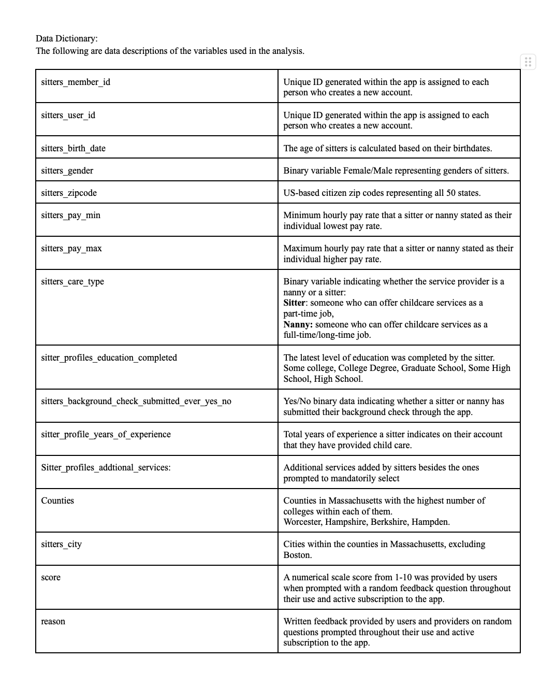

\newpage

# Methods

In order to supplement our proposal, pitching for the incorporation of a College Student component on the Sittercity platform, we conducted a comprehensive research initiative comprising both market research and data analysis.
Our objective was to not only understand the current landscape of Sittercity but also to provide a data-driven foundation for our proposed enhancements.

### Market Research

1.  Unbiased Exploration:

    We started our research by obtaining an unbiased perspective on Sittercity.
    Utilizing reliable research sites, we gathered information to comprehend Sittercity's reputation, user interface, and overall user experience.
    This approach was crucial in identifying areas of improvement without any preconceived notions.

2.  Immersive Platform Experience:

    To gain firsthand insights, we actively engaged with the Sittercity platform.
    We created decoy accounts, both from the perspective of a guardian and a potential sitter, immersing ourselves in the user experience.
    This hands-on approach allowed us to identify pain points and envision improvements from the user's standpoint.

### Data Analysis

1.  **Demographic Analysis**

    Leveraging existing data provided by Sittercity, we conducted a thorough demographic analysis focusing on both sitters and guardians.
    Our analysis included geographical locations, educational backgrounds, and user reviews to understand the current user base and their experiences with the platform.

2.  **Massachusetts Focus**

    Recognizing the concentration of colleges and universities in Massachusetts, we honed in on this state for a more in-depth analysis, using it as a case study to support our argument for the introduction of a college student component.
    We looked into educational levels, locations, and levels of experience to identify the potential for a pool of reliable and capable college sitters in the Massachusetts area.

3.  **Customer Reviews**

    As per our data analysis, we understand that customer feedback is invaluable, especially when implementing changes.
    We analyzed customer reviews to gauge satisfaction levels, identify recurring concerns, and highlight positive aspects of the platform.
    This qualitative data provided a nuanced understanding of user experiences, allowing us to align our proposed enhancements with user expectations.

    Our market research and data analysis yielded compelling results.
    Specifically, in Massachusetts, the abundance of college and university students presents a significant opportunity for the integration of a College Student component of Sittercity.
    Customer reviews, both positive and negative, guided us in identifying areas that require immediate attention and improvement.
    Overall, our holistic approach to market research and data analysis formed a robust foundation for our proposal.

\newpage

# **Results**

In keeping with our proposed business idea, certain variables were prioritized to deliver efficient supporting insights.
To demonstrate that the new business model could be relevant to the future of Sittercity, we chose to focus on those sitters located in Massachusetts broken down by county, excluding Boston only, due to the popularity of the app in the city, we decided to focus on other cities within counties with potential to be exploited taking into account the number of colleges surrounding these areas.

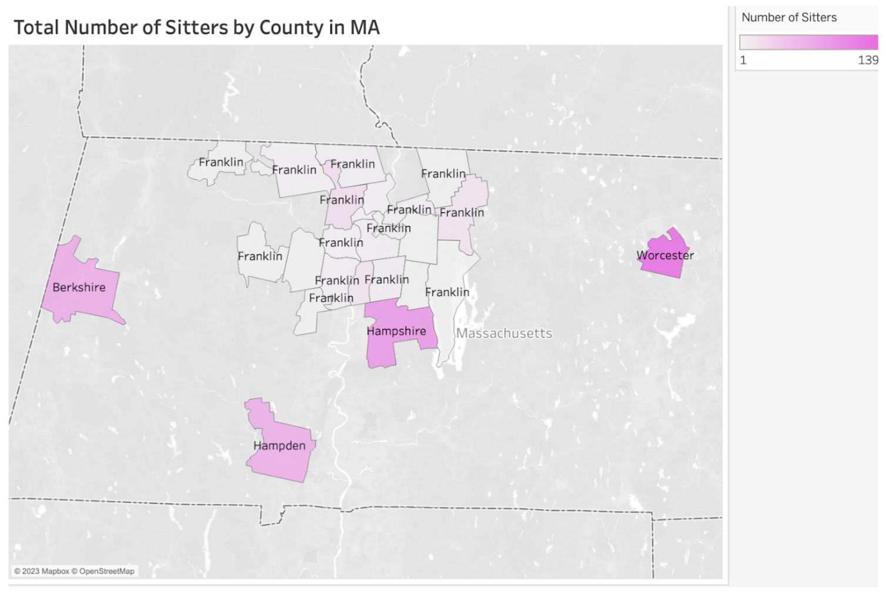{width="500px" height="450px"}

\newpage

*Age range*: We deliberately decided to make five different categories of age range to target our group of college students, since a traditional college student would fit within the category of 18-24 years old.
From the data provided, we can see that 42% of our providers are within that category range, which supports our idea that people within this age range are more likely to sign up.
This can be because many of these are individuals looking for a part-time job while studying throughout the academic year.

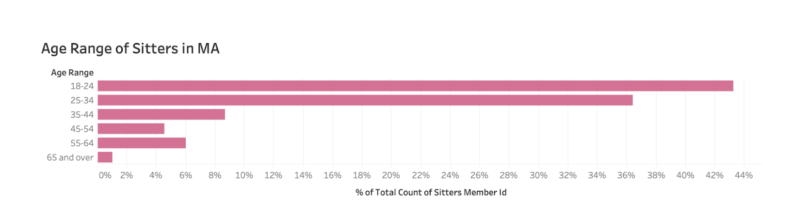{width="600px" height="200px"}

\newpage

*Level of Education*: Since Sittercity also asks for the level of education of the service providers, we were also interested in finding out whether most of these sitters were at college or had some type of college instructions as their qualification.
More than 45% of sitters signaled to either have a college degree or have some type of college education, which we assume to refer to someone who is still in the process of getting a degree or has completed their education.

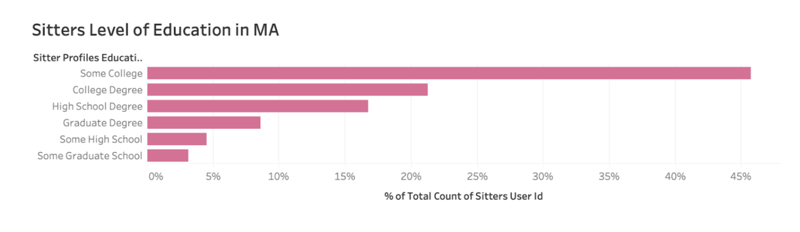{width="600px" height="200px"}

\newpage

*Years of Experience*: The data also showcases that the vast majority of sitters' years of experience range from 0--10 years, emphasizing 0--5 years.
This is another example of how the experience that could be brought to SitterCity can be from students who have had experience working in settings where childcare was required.

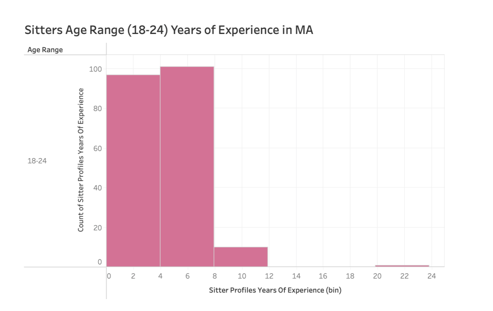{width="460px" height="400px"}

\newpage

*Hourly Pay Rate*:Another key factor of interest to our business proposal and data analysis was looking at the hourly minimum pay rate established by sitters in Massachusetts counties.
This was to determine whether we could advertise signing up as a sitter as a better option than, for example, working an on-campus job with a minimum wage pay rate of \$15 per hour.
Most sitters with 0 to 8 years of experience ask and get paid a minimum of \$18 or more.
We can then conclude that a student could make more work as a sitter for an average of 10 hours than working on campus, or if taken as extra hours, this could also still be beneficial enough for them to acquire a membership within the app.

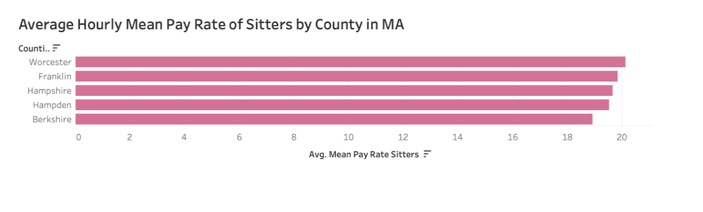{width="600px" height="200px"}

\newpage

*Average Compensation of Sitters in MA based on Years of Experience and Level of Education Completed*:

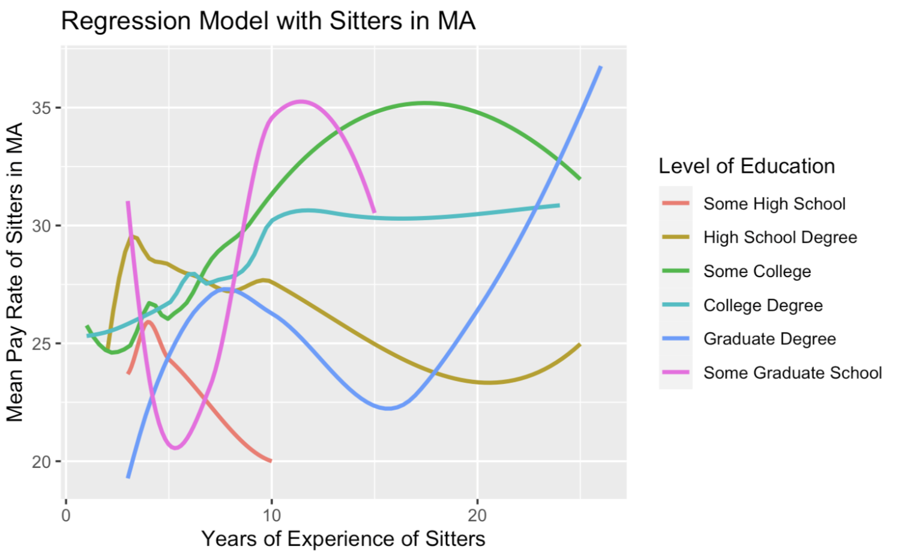{width="600px" height="400px"}

Note: Outliers were filtered in both dependent and independent variables.
Years of Experience = 40 Average Pay Rate = 60 \newpage Through a regression model, we were interested in understanding whether there were any significant differences or relationships between the minimum pay rate and sitters' college years of experience.
To summarize, we wanted to answer the following questions:

H0: Babysitters' minimum pay rate is higher based on their years of experience.
H1: Babysitters minimum pay rate is not higher based on their years of experience.

***Do sitters get paid more based on their years of experience or their level of education?***

For people with only 'Some High School Degree', we can observe that their average pay rate starts very high, more than \$18, yet as years pass by, the amount of money they get paid decreases, meaning that although they gain more experience in the field, their missing higher education, does lower their opportunity of a higher pay rate.
For those with a High School Degree only, the minimum pay rate starts pretty low and gets higher as more years of experience are added, one suggestion was that this occurs because people without a continuation of their higher studies make their sitter job their full-time employment.

On the contrary, for those with some college education or a degree past the undergraduate level, we can observe that although their minimum pay rate is higher at 0 years of experience, the rate keeps increasing as they start acquiring more years of experience.
This tells us that years of experience can help increase the pay rate asked by sitters, yet it will be more significant for those with a college degree education, which is our target group of people.

\newpage

*Additional Services: Various Age Ranges*:

In this visualization, we aimed to analyze the additional services provided by sitters and identify patterns among demographics to pinpoint sitters and their super-star qualities.  Our graph revealed that individuals in the 18-24 and 25-34 age groups offer more of a diverse range of additional services. It appears that younger sitters, aged 18-24 and 25-34, tend to provide more services, possibly driven by a desire to earn more income and possessing the mobility and patience required for these offerings.
After seeing these, we want to bring our focus back to college students, and after revealing that ages 18- to 24 offer more additional services, we were curious to see how many of those were college students.


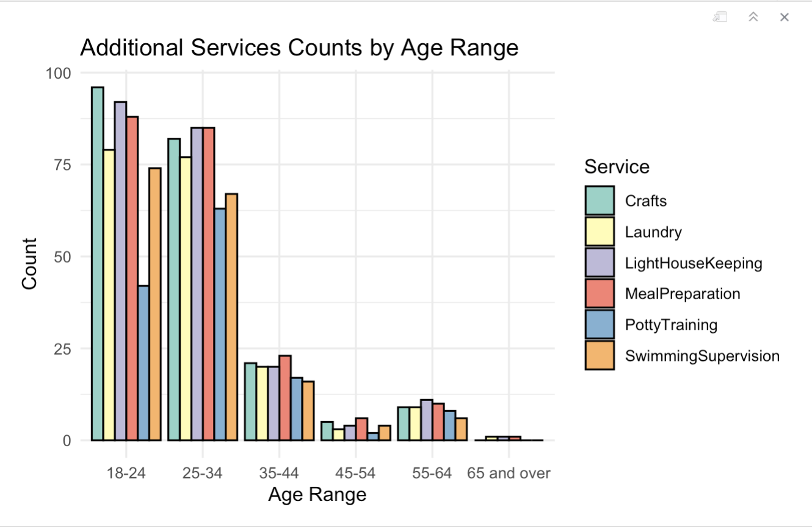{width="600px" height="300px"}


\newpage
\newpage

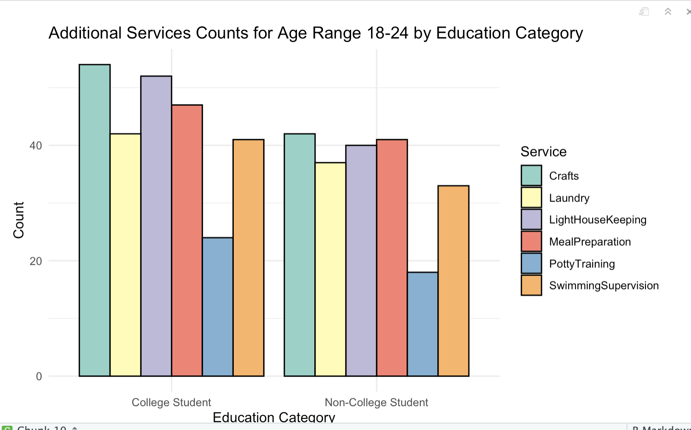{width=600 height=300}


After honing into the 18-24 age range, we can't assume that all individuals within this demographic were necessarily college students. So to refine our analysis, we further categorized them based on their education levels: some college, college degree, or graduate degree were labeled as "college students,", while those with other educational backgrounds were categorized as "non-college students." We wanted to see how many additional services were offered by each group within the same age range. Our investigation revealed a clear distinction between college and non-college students in terms of the additional services they provide. Despite the slight difference, there was still a difference observed in the extent of additional services offered. For instance, for  light housekeeping, over 60 college students displayed an inclination to offer such services, while their non-college counterparts numbered just under 40. This discrepancy could be attributed to various factors, such as the discipline instilled in college students or their familiarity with independent living during their college years.

Our visualizations,  distinctly illustrate that college students are more inclined to offer a broader spectrum of additional services compared to their non-college counterparts. This insight strengthens our argument that this demographic is pivotal when enhancing sitter profiles and tailoring initiatives aimed at improving the overall platform. It is noteworthy that the data highlights the potential benefits of focusing on college students, given their preference for offering a diverse range of services, thereby contributing to the platform's growth and appeal.

*Text Mining Analysis on Feedback "Reason" for Score :*

Sittercity, the app, randomly prompts its users in a question box to rate their service and give written feedback on the app throughout their time as users and when quitting the subscription.
Data mining was used to first filter the scores given, where from 0-5 it is considered "Positive Feedback" and 6-10 "Negative Feedback".
Once this filter was performed, a world cloud was built.
The wordclouds can be found in the appendix.

*Positive Feedback*: Overall, patterns found can tell that users like the easiness of use of the app, its helpfulness, and that both pay and the wide variety of range of sitters have provided users a good experience that would make them recommend the app to other people.

*Negative Feedback*: On the other hand, first, the negative feedback tells that the main issue around dissatisfaction with the service is the unavailability of sitters within specific mile ranges, second the fact that a background check needs to be paid for by parents can also become an obstacle for people to use the service, and lastly the ineffectiveness of communication and to get to have the actual sitter perform their job from the first message contact to real life.

### [**Next Steps:**]{.underline}

A dedicated tab will be provided for college students to register.
During the sign-up process, students will encounter the familiar registration page, with a strong encouragement to register using their official school email addresses.
Following registration, students will receive a verification email prompting them to confirm their email and verify their identity.
Upon successful registration, they can log in using their school credentials, triggering a two-factor authentication process facilitated by the university's IT service administrator.
It's important to note that the two-factor authentication process is a separate procedure managed by the university IT services.

After completing the verification process, the sitter's profile will be marked with a green checkmark, signifying a verified college student sitter.
This streamlined verification is facilitated by the prior background check conducted during their enrollment through the institution.
This will allow parents to promptly recognize and ensure the credibility of verified sitters.

If parents desire an additional layer of security and opt for a background check, they can make that request, which college students can swiftly and easily fulfill.
This is possible because specific departments within their college campuses provide the required documentation upon request.

Students will sign up at a reduced cost and this will give them access to the badge and prioritization in the services offered search results.
However, students will be offered a free one-month trial first.
Once they realize they can make more of their time through the flexibility of hours offered and set a higher minimum pay rate, then they will choose to stay in the app and pay for the monthly subscription. 

### **Parental Benefits**

**Expanded Service Variety:**

Parents will benefit from a broader array of services beyond traditional babysitting.
College Students may offer additional services such as language practice, physical activities, or music lessons.
This enhances the options available for parents, catering to a diverse set of needs.

**Reliability and Trust:**

The collaboration between SitterCity and colleges introduces a new batch of subscribers, and a potentially more reliable and trustworthy pool of sitters.
This can instill confidence in parents, as the platform leverages the credibility of college communities and their associated values.

**Geographic Coverage Assurance:**

Addressing concerns raised by parents in certain areas, the targeted coverage around college campuses aims to ensure that premium users can find adequate service providers.
This strategic approach contributes to a more reliable and widespread availability of sitters in locations where parents often seek childcare services.

**Cost-Efficiency:**

The potential reduction in marketing expenses coupled with the increase in subscribers from college communities indirectly benefits parents.
Additionally, as the platform grows, operational costs may be better distributed, potentially resulting in cost-effective services for parents.

### **Student Perks**

Students can sign up at a reduced cost and enjoy a complimentary one-month trial.As they discover the advantages of the SitterCity student account, they may opt to continue using it and subscribe to the monthly plan. 

Students subscribing to the service can access a range of perks, like discounts at local stores and additional subscriptions such as Hulu and Spotify.They also have the opportunity to become Sitter City brand ambassadors, where they can organize on-campus events and workshops, promoting the app within the community. 

### **Business Incentives**

**Increase Subscriber Base**

The collaboration between SitterCity and colleges has the potential to significantly boost the number of subscribers. 

**Enhance Parent Services**

With a diverse pool of sitters offering various talents, the platform becomes a reliable resource for parents seeking childcare with unique and supplementary services.

**Targeted Location Coverage**

Recognizing the widespread presence of colleges across states, tapping into college student communities ensures a broad geographic coverage.This strategic approach addresses feedback about insufficient service providers in specific areas, especially where premium users seek sitters.By focusing on zones around college campuses, this collaboration aims to alleviate this issue.

**Revenue Growth**

The anticipated influx of subscribers from college student communities is poised to drive a significant increase in SitterCity's revenue.
This growth is expected to be accompanied by a reduction in marketing and advertising expenses.Additionally, this collaboration strengthens the platform's trustworthiness, positioning it as a reliable choice for finding service providers, addressing existing weaknesses in comparison to competitors.
\newpage

```{=tex}
\begin{figure}
  \centering
  \includegraphics[width=300px, height=150px]{IMAGES/UX1.png}
  \caption{User Experience (UX) Mock Design of SitterCityxCollegeCollab on SitterCity Homepage}
\end{figure}
```
```{=tex}
\begin{figure}
  \centering
  \includegraphics[width=300px, height=150px]{IMAGES/UX2.png}
  \caption{SitterCityxCollegeCollab on SitterCity Sign-Up Page}
\end{figure}
```
\newpage

---
\newpage
# Conclusion


To summarize our capstone, we can start by stating that the goal of this project was open-ended from the very beginning, Thus, we came up with a business proposal of interest for our data sponsor, Sittercity, by conducting an extensive exploratory data analysis combined with our experiences as college students based in Massachusetts, specifically within the 5-college community.
This business plan was intended to counter the decline in premium subscribers and to realign Sittercity towards its foundational objective of serving as a platform for offering childcare services.
Once we found out that the data provided by Sittercity matched the skills and demographics of most college students, we proposed a new subscription for college students only at a lower rate than what the actual premium subscribers pay now along with external research that supported the effectiveness of the idea. 

### **Limitations**

The main limitation of this business case study is the randomization and small sample size of the data compared to the original sample size provided to us.
Due to us only extracting 10% of the data, we were left with a sample size that was not as significant and therefore not representative of the entire population of Sittercity subscribers.
Similarly, Massachusetts as a singular state is not representative of all states of the US, therefore an assumption that the business case presented within MA could work in other states is indefinite.
Lastly, we chose to focus on efforts related to the sitters, and we did not analyze much data related to the other types of service providers nor the parents or service users. 

### **Future applications**

Analyzing the data with a full dataset divided by states all across the US would provide a better understanding of the general profile of the most popular sitters.
Additionally, conducting a text analysis using the feedback provided to the app would be beneficial to identifying targeting points from specific communities in order to effectively come up with strategies that could improve the service. 

The next steps for this business proposal would be to conduct a test group within one of the suggested college communities where the idea is implemented, followed by a careful analysis of the profits and revenues made as well as the effectiveness of the service app for both sitters and providers of the services. Additionally, it would be beneficial to conduct a pilot group for a minimum of a year, including winter and summer breaks to also have an overview of the results throughout the fluctuation of the school year.
We some business schools would be prime candidates for collaborating with this project.

\newpage

# Appendix

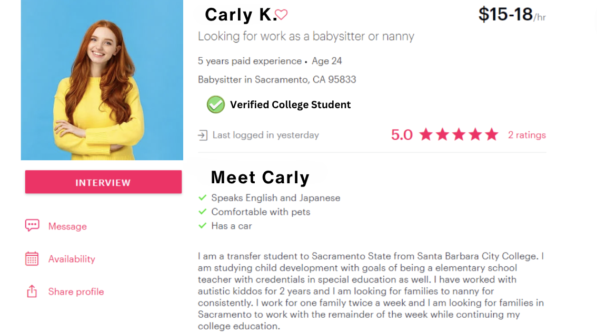
*UX Mock Design of Verified College Sitter Profile*

\newpage


*Positive Reviews Of SitterCity*

\newpage

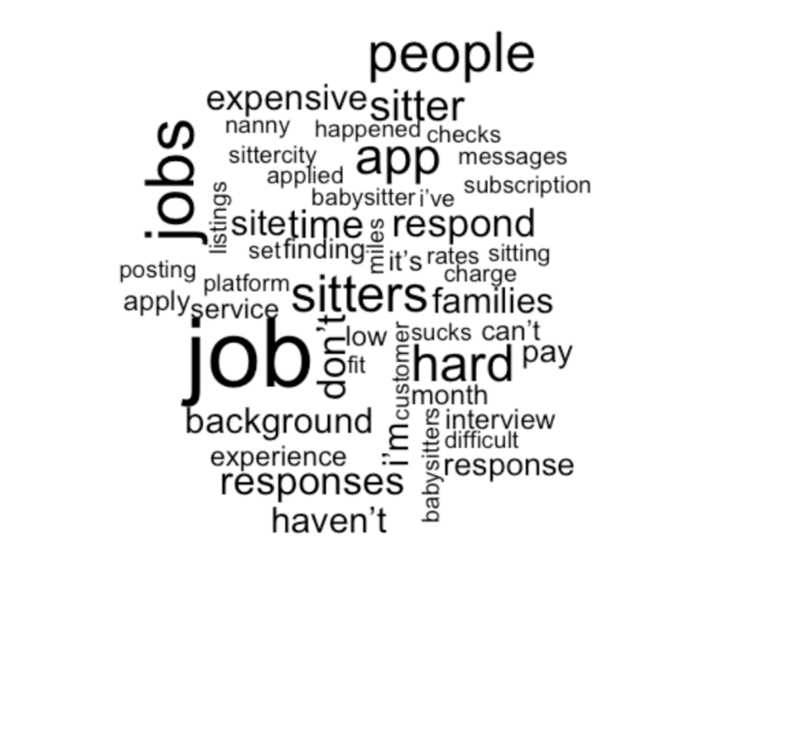
*Negative Reviews of SitterCity*

\newpage

# References
